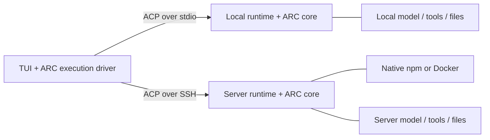

# DSH ARC

A composable terminal workbench built on DeepSeek Harness. Move one conversation
between your computer and an SSH server, keeping its context, Home and draft.
Each runtime executes its own tools with its own model configuration.

Version 1.0.0 packages the tested runtime and required native components. The full
archive is about 128 MB; no model weights are included.

## Native installation

Requires Node.js 22.20+ on macOS or glibc Linux (arm64/x64). Install with npm:

```sh
npm install -g @jasonning/dsh-arc@1.0.0
dsh-arc --version
```

Configure an OpenAI-compatible model endpoint (replace the example values):

```sh
dsh-arc init --provider my-provider --model my-model --base-url https://example.com/v1
export DSH_ARC_API_KEY='your-key'
dsh-arc doctor
dsh-arc --workspace /absolute/project
```

Alternatively, select a route from an existing DSH installation on the same host:

```sh
dsh-arc init --from-dsh-home /absolute/existing-dsh-home --provider existing-route --model existing-model
```

Initialization copies the existing settings file and references the host's existing
credential file. Executable machine patches and project files are not copied.
The default ARC home is `~/.local/share/dsh-arc`; override it with `--home` or
`DSH_ARC_HOME`. An existing nonempty home is never silently overwritten.

## Interaction

- `/arc switch` or Alt+X: switch runtimes after the current turn completes.
- `/arc reconnect` or Alt+G: explicitly reconnect to the same remote session.
- `/arc status`: show runtime, Home, conversation and workspace.
- Esc: cancel the current turn. Press Ctrl+D twice while idle to save the draft and exit.

File contents, credentials, permissions and plugin-private state do not automatically
move between machines. Checkpoints carry conversation context, not model KV caches.
Runtime processes currently belong to their connection; this is not a background-job service.

## SSH runtime

Install and initialize the same version on your server, using the native commands above.
Keep its model configuration independent. Credentials must be available to the SSH
noninteractive process (or use an existing DSH credential file on that server).
Then register the server from your computer:

```sh
dsh-arc remote add my-server --workspace /absolute/server-project
```

If the command is outside the server's SSH PATH, supply `--remote-command
/absolute/path/to/dsh-arc`. Use `--remote-home /absolute/arc-home` for a nondefault
installation. This read-only query retrieves paths, not credentials.
An offline alternative is `dsh-arc runtime-config --workspace /absolute/server-project`
on the server, followed by `dsh-arc remote add my-server --config ./server-runtime.json`
with its JSON output saved locally.

Host keys must already be verified, and system SSH must authenticate noninteractively.
Private keys stay with system SSH. No agent forwarding or additional service port is used.

## Docker runtime

Download `jasonning-dsh-arc-1.0.0.tgz` from the release into
`distribution/docker/dsh-arc.tgz`, then build from the `distribution` directory:

```sh
docker build -f docker/Dockerfile -t dsh-arc:1.0.0 .
```

Create directories owned by the account that will run the runtime. Initialize once:

```sh
mkdir -p "$HOME/.local/share/dsh-arc-container" "$HOME/arc-workspace"
docker run --rm -i --user "$(id -u):$(id -g)" \
  --mount "type=bind,src=$HOME/.local/share/dsh-arc-container,dst=/data" \
  dsh-arc:1.0.0 init --provider my-provider --model my-model --base-url https://example.com/v1
```

Register the container from your computer; every path below belongs to the server:

```sh
dsh-arc remote add my-server --docker-image ghcr.io/jasonning96/dsh-arc:1.0.0 \
  --data-dir /absolute/server/arc-data --workspace /absolute/server/project \
  --user 1000:1000 --env-file /absolute/server/model.env
```

The optional owner-readable environment file can contain `DSH_ARC_API_KEY=...`.
It stays on the server. The SSH account needs Docker access and read/write access
to the two explicit directories. Use the same UID:GID for initialization and runtime.

ARC runs the container through host SSH using `docker run --rm -i --init`, without a
pseudo-TTY so ACP stdout stays intact. `/data` persists runtime configuration and
sessions; `/workspace` contains the explicitly mounted project. The image contains
no model credentials. Containerized tools see mounted resources, not the whole host.

## Upgrade

Close every ARC session, back up the ARC home, install the next npm version, then
run `dsh-arc upgrade`. It refreshes bundled plugins and module links while preserving
model settings, user bundles and sessions. A different configuration schema is
refused rather than converted implicitly. For Docker, pull the next image and run
its `upgrade` command with the same `/data` volume and UID:GID before selecting it.
Changing only the Docker image preserves the conversation index.

## Uninstallation and scope

`npm uninstall -g @jasonning/dsh-arc` removes the command and installed package. The ARC home,
workspaces and remote data remain. `dsh-arc remote remove` removes the local endpoint
configuration only. Back up the ARC home before changing release versions.

This distribution includes a MIT-licensed dsh-TUI execution-interface extension,
identified as `0.10.1-arc.1.0.0`. It is not an upstream release. See
[THIRD_PARTY_NOTICES.md](THIRD_PARTY_NOTICES.md).

## Architecture



Handoff transfers a validated conversation checkpoint at an idle boundary. The source
is retained until the target import is committed. Home describes task ownership;
switching execution does not change Home or confer additional file access. The core
is optional and independent of the UI. The execution driver uses the explicit TUI
extension interface, without runtime source rewriting.

See [BUILDING.md](BUILDING.md) for source builds and [LICENSE](LICENSE) for the MIT license.
