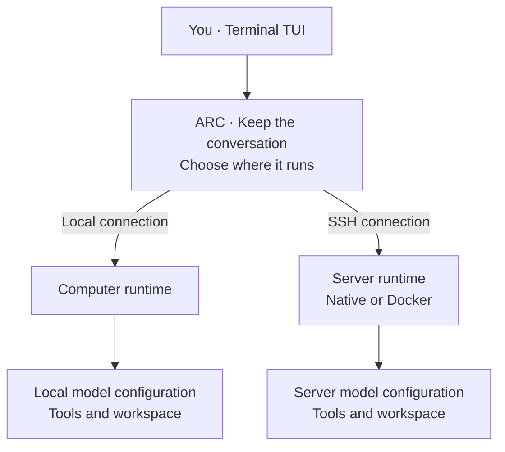

# DSH ARC

**One conversation. Independent runtimes.**

ARC — *Agent Relay Control* — is a composable workbench built on DeepSeek Harness.
Start locally, switch execution to your server, and continue the same conversation.
Context, draft and Home stay with the conversation; each runtime uses its own model,
tools and workspace.



**Available in v1.0:** streamed replies, idle-time handoff, context and draft retention,
reconnect and session recovery. Switching execution preserves **Home**, the work's
origin; it does not sync files or grant access to another machine's resources.

The longer-term direction is **multiple devices, one conversation**, with optional
cloud sync and scoped delegation. See the [target design](docs/design.md#7-目标架构多端协同一个会话).

## Quick start

Requires Node.js 22.20+ on macOS or glibc Linux. Download the `.tgz` from
[Releases](https://github.com/JasonNing96/dsh-arc/releases/tag/v1.0.0), then:

```sh
npm install -g ./jasonning-dsh-arc-1.0.0.tgz
dsh-arc init --provider my-provider --model my-model --base-url https://example.com/v1
export DSH_ARC_API_KEY='your-key'
dsh-arc --workspace /absolute/project
```

Replace the provider, model, endpoint and key with your own. To continue on a server,
follow the [SSH setup](docs/usage.md#ssh-runtime) or [Docker setup](docs/usage.md#docker-runtime),
then use **`/arc switch`** (Alt+X) in the TUI.

## Learn more

- [Installation & usage](docs/usage.md) — model setup, SSH, Docker, shortcuts and upgrades.
- [Design & architecture / 设计总稿](docs/design.md) — diagrams, Home, boundaries and future work.
- [Documentation index / 文档导航](docs/README.md) — roadmap, community direction and research.
- [Build from source](BUILDING.md) · [Repository map](docs/repository-map.md) · [Validation](VALIDATION.md).

The bundled TUI is the identified ARC extension `0.10.1-arc.1.0.0`.
[MIT license](LICENSE) · [Third-party notices](THIRD_PARTY_NOTICES.md).
