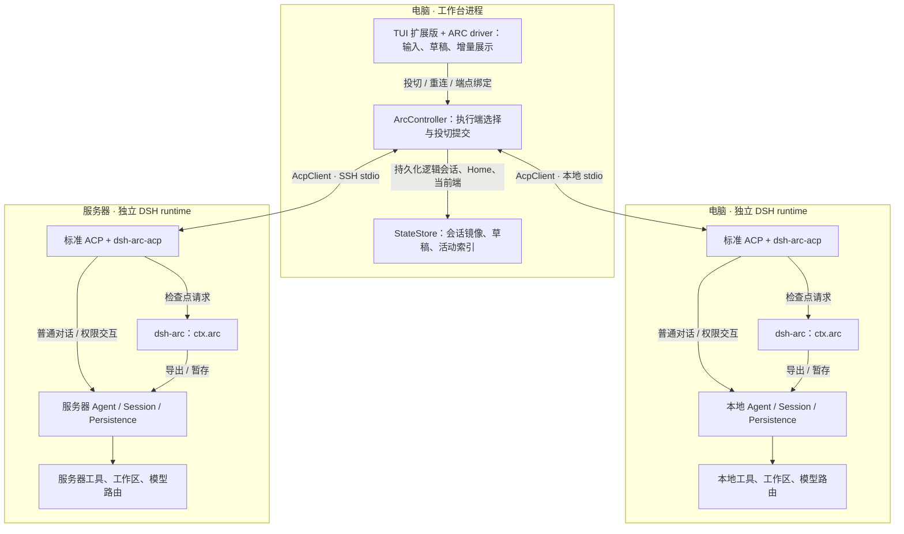
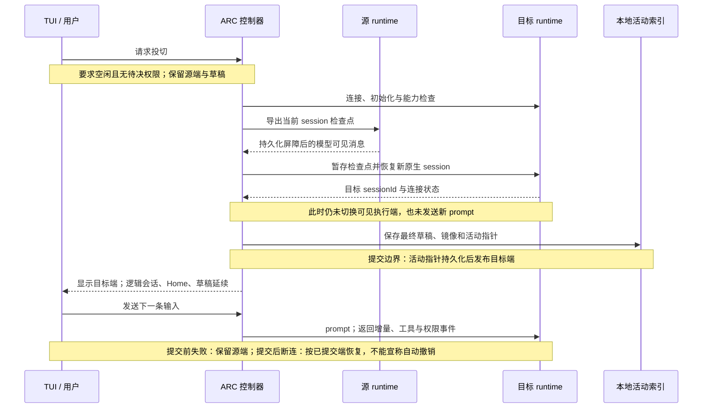
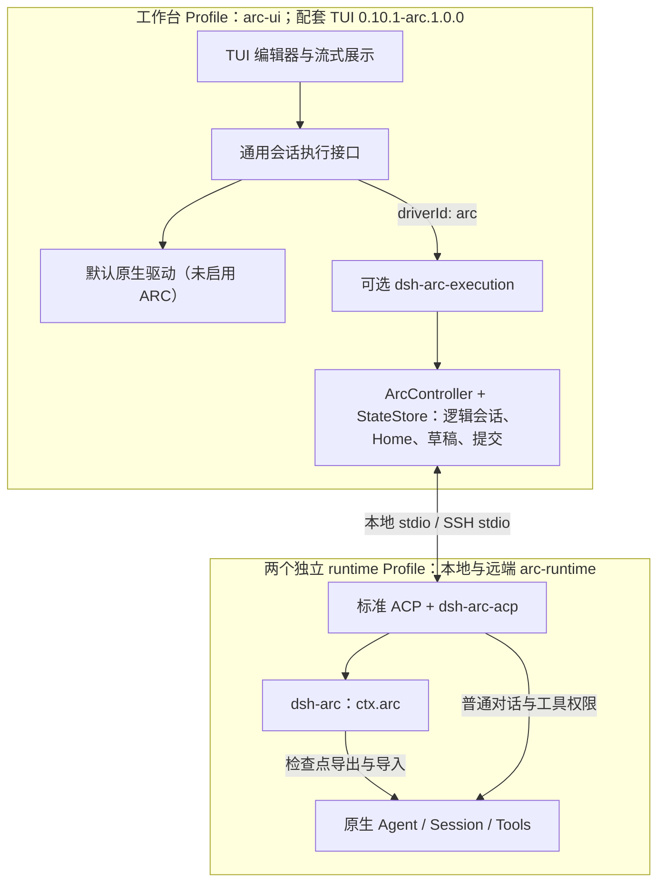
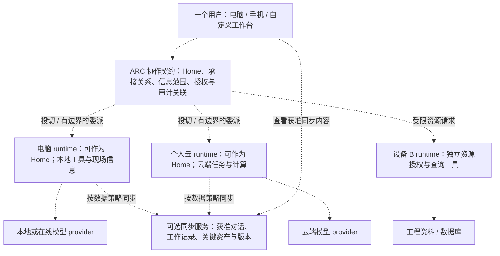
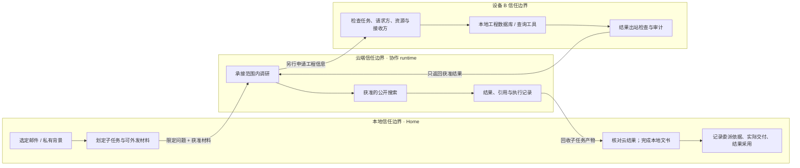

# DSH ARC：设计思路与架构总稿

> Agent Relay Control · v1.0 实现基线 · 文档修订 2026-09-18
>
> 工作有归属，执行可接力。多个独立 runtime，延续同一个会话。
>
> 本文整合早期三端 PRD、端云接力讨论、Home Runtime 设计、插件验证与 TUI 迁移结果，并以 v1.0 源码修正历史状态。它是架构参考，后续目标不是本版功能承诺。

## 1. 产品为什么需要 ARC

DSH ARC 面向 FDE、个人开发者和日常工作人员，是单用户、可组装的工作台。长期希望形成类似 Obsidian 的开放生态：核心可以独立使用，界面、工具和工作流可以替换，个人云是可选服务。

电脑、手机和云有不同的能力。电脑能访问用户授权的本地工作区和应用，手机未来可以提供拍照等现场信息，云适合承接远程计算与较长任务。它们应各自拥有独立 runtime，而不是把所有设备都视为同一个云 Agent 的遥控器。

ARC 负责组织这些 runtime 如何延续工作。DSH 继续负责 Agent、模型调用、工具和原生会话。我们关心的是执行归属与信息连续性，不要求用户把所有能力迁入一套封闭工作台。

早期提出的个人云约 $5/月是商业设想，尚未形成可购买服务、定价承诺或无限模型/算力额度。本版交付本地 TUI 与自管服务器接入，不包含移动客户端和托管云平台。

## 2. 五个必须分开的概念

| 概念 | 回答的问题 | v1.0 的表达 |
|---|---|---|
| 交互端 | 用户在哪里输入、查看？ | 电脑 Terminal 中的 TUI |
| Home Runtime | 当前工作归属于谁？ | 逻辑会话的 Home 元数据，投切时保留；当前新会话从本地开始 |
| 执行端 | 谁执行下一次工具调用？ | 当前选中的本地或远程 DSH runtime |
| 推理位置 | 哪个模型在哪里处理输入？ | 各 runtime 独立的 provider/model 配置 |
| 数据保留与出站策略 | 什么可以交付、保存给谁？ | 各端持久化已有实现；细粒度出站策略与云同步开关尚未实现 |

**Home 是工作归属信息，目前不是权限执行器。** 本地 runtime 调用在线模型时，输入仍会发往模型服务；Home 在本地不能自动保证数据不出设备。

一个逻辑 `conversationId` 可以对应多个原生 `sessionId`。前者维持用户看到的工作连续性；后者属于具体 runtime 的原生持久化。投切时目标创建新的 session，逻辑会话、Home 与草稿继续保留。

还要区分三种操作：

- **模型切换**：改变推理服务，不必改变工具执行位置。
- **执行投切**：v1.0 在空闲边界把当前会话的后续执行交给另一端，Home 不变。
- **子任务委派**：主任务留在 Home，只把限定任务与材料交给协作端；这是后续设计。

主任务 Home 迁移、并行多端写入和自动调度同样未包含在当前投切协议中。

## 3. v1.0 控制面与数据面



[静态矢量图：v1.0 当前运行架构：工作台控制，两端独立执行](diagrams/01-current-runtime.svg)

[编辑图 1 的 Mermaid 源码](diagrams/01-current-runtime.mmd)

**控制面**处理运行端选择、能力检查、会话映射、取消、重连和投切提交。它的入口在 TUI，核心流程由 ARC driver 与 `ArcController` 组织。

**数据面**承载 prompt、流式回复、工具/权限事件和对话检查点。两者是职责划分，当前共用 ACP 连接，不是两套独立部署的服务。模型请求从各 runtime 发出；工具操作发生在各自工作区。

| 层次 | 组件 | 责任 |
|---|---|---|
| 界面 | 配套 TUI `0.10.1-arc.1.0.0` | 输入、流式展示、权限交互、快捷键 |
| 工作台扩展 | `dsh-arc-execution` | 注册 ARC 执行驱动，提供命令与状态 |
| 控制器 | `ArcController`、`StateStore` | 会话映射、草稿、持久活动指针、投切与恢复 |
| 传输 | `AcpClient` | 本地子进程 stdio；远端 SSH stdio；Docker 复用 SSH |
| Runtime 扩展 | `dsh-arc` + `dsh-arc-acp` | 检查点导出、校验、导入与 ACP 扩展 |
| 原生内核 | DSH Agent / Session / Tools / Provider | 推理循环、工具、权限、原生会话持久化 |

两端之间没有后台全量同步链路。检查点由工作台从源端读取，再交给目标端。本版的云端会话保存是远端 runtime 自己的持久化，不等于已经实现独立云同步服务。

代码入口：[控制器](../tui/src/arc-controller.ts)、[存储](../tui/src/state-store.ts)、[ACP 客户端](../tui/src/acp-client.ts)、[ARC 服务](../plugins/dsh-arc/src/index.ts)。

## 4. 一次投切如何完成



[静态矢量图：投切时序：目标准备成功后提交活动指针](diagrams/02-handoff-sequence.svg)

[编辑图 2 的 Mermaid 源码](diagrams/02-handoff-sequence.mmd)

用户等待当前回复和工具处理结束，输入 `/arc switch` 或按 Alt+X。系统先保存源端草稿，连接目标并检查能力，再导出检查点、导入目标原生会话，最后持久化活动指针并显示目标端。投切本身不发送新的模型 prompt。

关键提交点是本地活动指针成功持久化，而不是 SSH 已连接，也不是目标已经分配 session ID。

| 情况 | 行为边界 |
|---|---|
| 正在生成、工具调用未闭合或权限待决 | 不能把在途工作当作已完成检查点迁移 |
| 目标不可达、能力不匹配、导入失败、准备阶段取消 | 不提交目标；保留源端为当前会话，清理本次创建的连接与会话资源 |
| 提交成功后显示或旧连接清理失败 | 目标已经生效，不能再声称回滚到源端；保留错误反馈与资源所有权 |
| 已提交端断连 | 显示断连状态，以 `/arc reconnect` 恢复；不盲目重放可能产生副作用的 prompt |
| 应用关闭 | 释放本次连接/进程和锁，保留已持久化会话；不承诺后台任务继续执行 |

准备失败后的目标可能仍有持久化历史痕迹；资源关闭不等于安全删除远端已经接收的数据。取消也不能撤销已经发生的文件、网络或数据库副作用。

### 检查点携带什么

当前格式为 `version: 1`、`sourceCwd` 和 `messages`，大小上限 **2 MiB**。它来自原生会话当前的模型可见消息视图，包含已有压缩/回忆后的结果，不必等于完整事件日志。

- 允许的内容包括文本、reasoning 块，以及成对且已完成的工具调用/文本结果记录。
- 源端系统消息与指定的环境提示被过滤；目标使用自己的模型配置和工作区规则。
- 附件、未完成或不匹配的工具调用、超限检查点会被拒绝。
- 导入构造已完成的历史事件，再由原生 ACP 恢复；不会执行历史工具。
- 不迁移模型 KV cache、进程内存、运行中的 shell、文件目录、凭据文件或插件私有状态。

**不搬运文件不代表历史消息不含文件内容。** 曾进入对话的邮件正文、工具结果、路径或其他敏感文本，仍可能进入检查点。当前没有“只允许某一封邮件”的资源筛选与出站策略引擎；只有在允许将该会话上下文交给目标端时才应使用本版投切。

检查点是当前可验证的工程基线，不是最终的信息状态同步算法。实现见 [checkpoint.ts](../plugins/dsh-arc/src/checkpoint.ts)。

## 5. 插件如何组装，哪些还需要适配



[静态矢量图：插件组装：TUI 执行接口、ARC driver 与 runtime Bundle](diagrams/03-plugin-assembly.svg)

[编辑图 3 的 Mermaid 源码](diagrams/03-plugin-assembly.mmd)

DSH 用 Cordis 服务、Bundle 元数据和 Profile 组合工作台。ARC 核心以 `ctx.arc` 提供能力；集成 Bundle 将能力交给特定消费者，没有复制另一套 Agent 内核。

| 组合 | 使用位置 | 能力与限制 |
|---|---|---|
| `dsh-arc` + `dsh-arc-acp` | 本地、服务器 runtime Profile | 完整投切所需的检查点与 ACP 扩展 |
| 配套 TUI + `dsh-arc-execution` | 工作台 UI Profile | 通过通用执行接口接入控制器，驱动本地/远端对话 |
| 原版 TUI + `dsh-arc` + `dsh-arc-tui` | 同进程 Profile，可选组合 | ARC 状态与检查点命令；仅装这组不会获得完整投切 |

**v1.0 的完整 TUI 使用明确标识的接口扩展版。** 配套版本是 `0.10.1-arc.1.0.0`；不能把 npm 原版 `0.10.1` 当作同一个包，也不宣称这项扩展已经被上游接受。当前分发路径不依赖加载时源码替换或 monkey patch。

接口将输入提交、事件订阅、取消、权限回应、状态快照和关闭从 UI 中分开。TUI 保留编辑和渲染；默认原生驱动与 ARC 驱动通过同一宿主契约接入。分发器为 ARC 配置 `driverId: arc`。

### 其他插件是否需要改写

- 普通工具、模型 provider、DSH 原生持久化插件，若只在各自 runtime 内工作，通常无需依赖 ARC；仍需检查版本、依赖、权限和环境兼容性。
- 插件需要在另一个 runtime 使用，应在那个 runtime 单独安装、配置和授权。投切不会自动复制插件或账号状态。
- GUI/TUI 想替换执行后端，需要对应的执行接口或适配器；单纯新增命令和状态栏不足以获得投切能力。
- 插件若依赖私有内存状态、后台进程、原生 fork、附件或跨端文件传输，需要显式扩展和验收。驱动未声明支持的能力应拒绝，不能静默降级。

拔掉 ARC 后，普通 DSH 工具不应承担 ARC 的依赖。卸载驱动前先关闭工作台，并恢复 UI 的默认驱动配置；卸载依赖核心的消费者后再移除核心。关闭 ARC 不代表删除已保留的会话数据。

### 使用分发器组装

在本地和服务器分别安装同版发行包、初始化各自模型；完整命令示例见 [安装与使用](usage.md)。模型凭据各端分别提供。随后本地执行：

```sh
dsh-arc remote add my-server --workspace /absolute/server/project
dsh-arc --workspace /absolute/local/project
```

安装器建立 `arc-ui` 与 `arc-runtime` Profile。高级组装入口见 [执行驱动说明](../plugins/dsh-arc-execution/README.md)和 [Bundle 配置](../plugins/dsh-arc-execution/cordis.patch.yml)。保留用户已有配置时，需注意 DSH patch 中 `config` 对象的整体替换语义。

## 6. 安装与运行数据的组织

源码仓库、安装包和用户数据有不同生命周期。源码目录见 [仓库导航](repository-map.md)；分发安装不应把会话或模型凭据写回源码。

```text
ARC_HOME/                      # 默认 ~/.local/share/dsh-arc
  config.json                  # 安装与模型选择元数据
  remote.json                  # 可选远端描述
  ui/                          # 工作台 Profile 与 UI 配置
  runtime/                     # 本机 runtime Profile、模型设置、原生会话
  packages/                    # 安装器保留的组件目录
  state/                       # 逻辑会话映射、镜像、草稿、活动指针和锁

远端 ARC_HOME/                 # 独立的数据目录
  runtime/                     # 远端自己的模型设置和原生会话
工作区/                        # 各端独立，投切不镜像它
```

SSH 提供主机身份校验和加密传输，系统 SSH 保管私钥。非交互连接需要已验证的主机密钥和可用的认证方式；不启用 agent forwarding。只有 SSH 密钥还不够，远端还需要安装 runtime、配置模型和准备可访问工作区。

Docker 是同一 runtime 的部署方式：通过 SSH 启动 `docker run --rm -i --init`，不用伪终端，以保持 ACP stdio 完整；持久 `/data` 保存 runtime 数据，显式挂载的 `/workspace` 提供工作目录。镜像不含模型凭据，环境文件留在服务器。容器进程随连接使用，v1.0 不提供常驻调度服务。

升级前关闭使用该 home 的会话并备份数据。`dsh-arc upgrade` 更新组件链接与 Profile，保留设置、用户 Bundle 和会话。Docker 复用同一 `/data` 与 UID:GID，单纯镜像版本变更不应改变逻辑会话索引。

## 7. 目标架构：多端协同，一个会话



[静态矢量图：目标多端架构：云同步和云执行分别组织](diagrams/04-target-architecture.svg)

[编辑图 4 的 Mermaid 源码](diagrams/04-target-architecture.mmd)

本节起为后续方向。图中虚线表示目标能力，不是现有部署连线。

一个人的多个设备关联一个逻辑个人云，不要求云只有一个物理进程，也不要求所有设备间协作都经过中央服务器。Home 可以在本地或云端；切换执行位置与迁移 Home 应分别设计。

云的两个职责需要解耦：

1. **保存与同步获准信息**：对话、工作记录、关键资产及版本。同步本身不需要运行 Agent。最初的偏好是新会话默认开启云同步、允许关闭，但保密策略优先；本版尚无此独立服务与开关。
2. **承接可选执行**：长程、重计算或多 Agent 工作。提交、受理、取消、产物、断连恢复和额度都需要单独定义，不能靠当前 SSH 投切自然推导出来。

三端核心、身份/设备配对、其他 harness 适配和云服务可以沿接口扩展。产品仍以单用户为中心；未来基础设施的租户隔离不等于加入团队成员管理产品。

## 8. Home、最小信息交付与审计



[静态矢量图：目标信任边界：本地邮件、云端调研与设备 B](diagrams/05-trust-boundaries.svg)

[编辑图 5 的 Mermaid 源码](diagrams/05-trust-boundaries.mmd)

### 场景 A：本地邮件，云端调研

邮件工作归属本地。用户选择邮件和可外发材料，本地只委派公开调研，云端返回来源与结论，本地结合未外发背景完成文书。云不因承接子任务而获得全邮箱权限。模型可读某段内容，也不意味着搜索引擎可以收到整段原文。

最小原型可以使用选定内容的只读快照。后续再验证按邮件、字段、版本、接收方和有效期限制的读取能力；不提前把快照定成唯一状态表示。

### 场景 B：云端开发，Git 产物回收

仓库可以归属云端，也可以留在本地、由云承接局部任务。涉及代码变更时明确基线提交、允许修改范围与返回产物，采用 branch/patch 并在 Home 核对和测试。

Git 描述文件状态与变更，ARC 描述谁执行和如何交接，两者可以组合。Git 本身不能迁移运行进程、数据库副作用和设备授权；ARC 的检查点也不能代替仓库同步。本稿不把此前竞品观察当作当前能力比较，避免用过期产品结论支撑设计。

### 场景 C：设备 B 的工程资料

B 上的独立 runtime 守住工程数据库边界。Home 或云端提出有范围的请求，B 重新检查请求者、任务、资源和接收方，使用确定性的工具/数据库权限限制实际查询，再检查结果出站范围。

Home 能访问 B，不代表其委派的云端继承这项权限。摘要、参数和推导结论也可能涉密，不能自动放行。Agent 可以理解问题和组织结果，实际边界不能只由提示词承担。

### 候选审计与故障约束

Home 记录委派依据和实际交付，协作端记录承接、工具与来源，B 记录访问、判断和出站；通过会话、任务、运行、授权与资产版本关联。避免把涉密正文重复写入全局日志。具体字段、签名和存储方式尚未冻结。

读取、处理、外发、保存、转委派分别判断。已有效的授权可复用；撤销阻止后续访问，不承诺收回已交付信息。回执丢失不能判定未执行，取消和授权撤销也不是副作用回滚。多层记录提高可追溯性，不自动提供防篡改或“恰好一次执行”保证。

## 9. 开放研究：异构模型间的信息状态

模型与 harness 解耦，开源模型优先，同时允许本地与云端混用不同模型，例如本地 Qwen 与在线 GPT。模型名称描述推理服务；Codex 等其他 harness 则需要另外的 runtime 接口适配，不能只换 provider 就宣称接入。但“把消息发过去”只解决了一部分连续性问题：两个模型可能拥有不同上下文容量、工具、记忆机制和可访问证据。

研究问题是：**在异构模型与不同信任边界之间，如何同步任务所需的信息状态，使接收端可靠延续工作，同时控制信息披露、成本与恢复开销？**

这里不预先选择完整历史、摘要或结构化任务包作为唯一答案，也不承诺迁移模型隐状态。候选信息包括事实与证据、约束、已完成工作、未决问题、依赖、资产版本、时效和权限。

| 研究维度 | 建议比较 |
|---|---|
| 表示基线 | 获准原始消息、摘要、结构化状态、按需检索、混合方式 |
| 质量 | 任务完成率、事实/约束保留、证据正确性、遗漏与重复执行 |
| 边界 | 非必要披露、越权请求、衍生信息外泄 |
| 变化与异常 | 过期证据、资产冲突、断连、迟到结果、撤权、多级委派 |
| 成本 | 传输量、token、时延、恢复代价 |

先用合成或明确授权的数据建立基线，再讨论算法与论文。指标阈值、研究新颖性和模型组合尚待验证。

## 10. 设计取舍与实现边界

| 决策 | 原因 | 代价 / 后续问题 |
|---|---|---|
| 小核心，使用可选 Bundle | 保持 DSH 可组装能力，普通工具无需认识 ARC | UI/harness 的执行契约仍需分别适配 |
| Home 与当前执行端分离 | 换设备不应悄悄改变工作归属 | 权限与 Home 迁移协议需要后续设计 |
| 空闲检查点交接 | 原生会话可落盘、可校验、可恢复 | 不支持在途进程或任务迁移；有大小/内容限制 |
| 活动指针为提交边界 | 源/目标准备状态与用户可见状态一致 | 必须区分提交前失败与提交后故障 |
| 工作区与模型配置各端独立 | 复用现有 DSH 和 SSH，降低首版部署复杂度 | 不会自动同步代码、依赖或私有插件状态 |
| 明确标识 TUI 接口扩展版 | 用通用执行入口消除运行时源码替换 | 仍需推动上游接受接口并维护版本兼容 |
| npm 分发 + Docker | 同一个 runtime 覆盖本机与远端 | 完整依赖及多平台原生组件使包约 128 MB |
| 信息状态同步保留为研究 | 避免过早锁死跨模型上下文表示 | 当前检查点不提供最小信息交付保证 |

## 11. 当前验收与下一阶段入口

v1.0 已有：本地/SSH 两端独立 runtime、流式展示、空闲投切、上下文/草稿/Home 保留、重连、重启恢复、插件分层、原生与 Docker 分发。2026-09-17 用户确认本机手工测试通过；自动化范围和运行平台见 [VALIDATION](../VALIDATION.md)。用户确认不扩大为未执行的平台或功能验收。

尚未实现：多设备同时写入、移动 runtime、托管同步服务、Home 迁移、受限子任务委派、跨端文件/Git 自动同步、细粒度授权与可验证审计、断连后独立长程执行、其他 harness 的通用接入。

下一阶段产品目标已确认为 **自主接入与可靠接续**：接入自己的独立 runtime，明确知道执行位置、交付范围与失败后的恢复位置。具体实现和分期尚未冻结。

1. 优先解决稳定环境身份、多端登记、连接与能力检查、重复请求及断连后的恢复；先对照 `dsh-distribution` 与 `dsh-std` 的边界。
2. 用 TUI 和第二个调用者验证执行接口可复用，沉淀真实跨 runtime 接力案例与公共接口缺口。
3. 受限委派保留为后续方向；信息状态同步单独建立研究基准，不把它们提前扩入当前投切保证。

实施建议、候选命令与验收出口见 [下一阶段技术路线](next-stage.md)；已确认的定位见 [社区贡献方向](community-direction.md)，证据和参与规则见 [社区调查](research/dsh-community-contribution-2026-09-17.md)。

新增 PRD 应逐条说明用户目的、前置条件、Home/执行/推理位置、数据范围、正常与异常流程、兼容依赖、验收证据和目标版本；分别标记“已实现”“已确认方向”“候选方案”“开放课题”。历史演变见 [设计沿革](history.md)。
